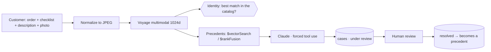
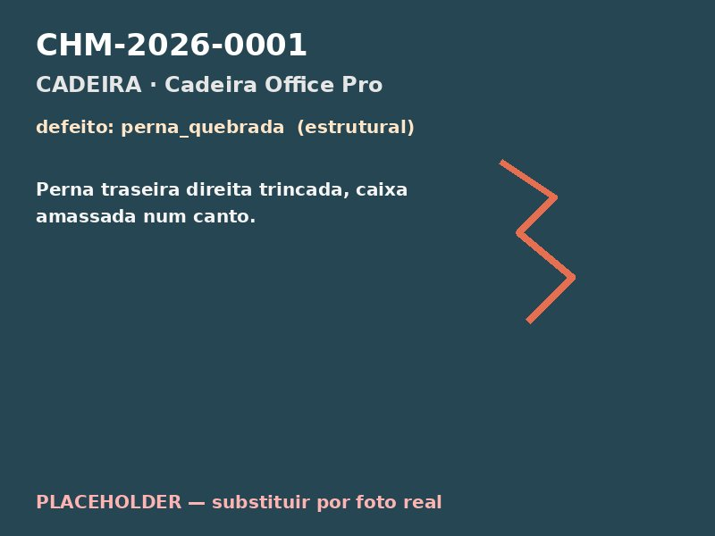
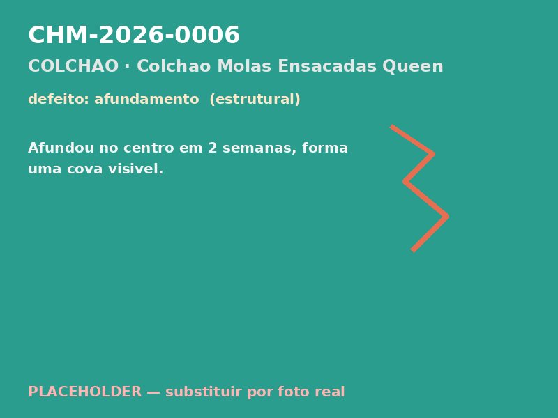

# Multimodal Warranty Triage

**A generic PoV for any retailer selling physical products** that needs to triage warranty claims with multimodal AI — MongoDB Atlas as the engine behind every layer, Voyage AI for multimodal embeddings and Claude for the verdict.

## The problem

Every retailer that ships physical products receives thousands of warranty claims: a photo, a vague description ("it arrived broken") and a human analyst who has to decide — factory defect? shipping damage? misuse? Manual triage is slow, inconsistent across analysts, and the accumulated knowledge (already-resolved cases) stays locked in spreadsheets and in people's heads. Worse: nothing guarantees the uploaded photo is even of the purchased product.

## The solution

The customer enters the order number, checks a symptom checklist, describes the issue and uploads a photo. From there:

1. **Product identity check** — the photo is compared (multimodal embedding) against the reference photos of the **entire** catalog. The signal is relative: the ordered product must be the best match among all of them — studio photos naturally score high against each other, so an absolute threshold alone would let the wrong product slip through.
2. **Precedents** — vector search (or hybrid with `$rankFusion`) retrieves resolved cases similar to the current one.
3. **Structured verdict** — Claude classifies the probable cause (**factory defect / shipping / misuse / inconclusive**) with *forced tool use* (structured output, no fragile JSON parsing).
4. **Mandatory human review** — every verdict is born `em_analise` (under review); only a human promotes it to `resolvido` (a consumer-protection requirement in Brazil). Each confirmed case becomes a precedent for the next ones — a knowledge flywheel.



The kind of input the pipeline works with — synthetic seed photos of damaged products:

| | | |
|---|---|---|
|  |  |  |

## MongoDB as the engine behind every layer

| Layer | Where it lives |
|---|---|
| Order lookup | collection **`pedidos`** |
| Defect checklist catalog | collection **`catalogo`** |
| Cases + verdict + embedding | collection **`chamados`** |
| Catalog reference photos (identity) | collection **`catalogo_fotos`** |
| Semantic search | **Atlas Vector Search** (`$vectorSearch`, index `defeitos_vector_index`) |
| Hybrid search | **`$rankFusion`** (vector + Atlas Search full-text `chamados_text_index`) |
| Real-time review queue | **Change Streams** (SSE, no polling) |
| Analytics | **Aggregation Pipeline** (Atlas Charts-ready) |
| Schema governance | **`$jsonSchema`** validators (`chamados`, `pedidos`) |

Image blobs live **outside** MongoDB — the correct blob-storage pattern. In the PoV they sit on local disk (`backend/media/`, served by FastAPI); in production you reimplement `storage.py` with S3 + CDN and the `(uri, url)` interface stays the same.

## Stack

- **Backend**: FastAPI + Motor (async), Voyage `voyage-multimodal-3.5` (1024-dim multimodal embeddings), Claude with forced tool use.
- **Frontend**: React + Vite + LeafyGreen (MongoDB's design system).
- Everything parameterized via **`.env`** (DB, collections, indexes, models) — see `.env.example`. Never commit a real `.env`.

## Setup (once)

```bash
cd backend
python3 -m venv .venv && ./.venv/bin/pip install -r requirements.txt

# populate MongoDB (reads .env)
./.venv/bin/python seed_meta.py            # orders + checklist catalog
./.venv/bin/python seed.py                 # 15 resolved cases (embeds their images)
./.venv/bin/python seed_catalogo_fotos.py  # 4 reference photos per SKU (identity)
./.venv/bin/python setup_indexes.py        # regular + vector + text indexes + $jsonSchema

# optional: placeholder photos before you have real catalog shots
./.venv/bin/python generate_placeholders.py
./.venv/bin/python generate_catalogo_placeholders.py
```

## Run

```bash
./start.sh        # backend :8100 + frontend :5190 (dev)
# full-pipeline smoke test:
cd backend && ./.venv/bin/python test_http.py
```

## Tests & lint

```bash
cd backend
./.venv/bin/pip install -r requirements-dev.txt
./.venv/bin/pytest        # unit tests (pure logic, no Atlas/network)
./.venv/bin/ruff check .  # lint
```

`test_http.py` is the live-server smoke test (needs the backend up and Atlas seeded) — `pytest` covers the logic that doesn't depend on the network.

## Endpoints

| Method | Route | What |
|---|---|---|
| POST | `/api/lookup` | order → products (reads `pedidos`) |
| GET | `/api/checklist/{categoria}` | checklist items (reads `catalogo`) |
| POST | `/api/analisar` | full pipeline; `modo=vector` or `modo=hybrid` |
| GET | `/api/chamados/pendentes` | review queue |
| POST | `/api/revisar` | human review → resolved |
| GET | `/api/analytics` | aggregations (Atlas Charts) |
| GET | `/api/chamados/stream` | Change Stream (SSE), new cases in real time |
| GET | `/api/health` | ping + counts + model |
| GET | `/api/metrics` | in-process metrics (latency, tokens, cache) |
