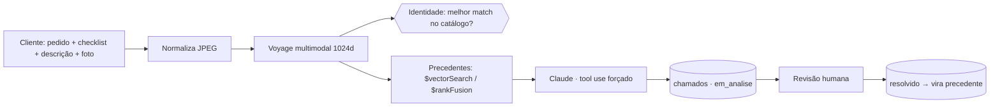

# Análise de Garantia Multimodal

**PoV genérica para qualquer varejista de produtos físicos** que precise triar
chamados de garantia com IA multimodal — MongoDB Atlas como motor de todas as
camadas, Voyage AI para embedding multimodal e Claude para o veredito.

## O problema

Todo varejista que vende produto físico recebe milhares de chamados de garantia:
uma foto, uma descrição vaga ("chegou quebrado") e um analista humano que precisa
decidir — defeito de fábrica? dano de transporte? mau uso? A triagem manual é
lenta, inconsistente entre analistas, e o conhecimento acumulado (casos já
resolvidos) fica preso em planilhas e na cabeça das pessoas. Pior: nada garante
que a foto enviada é sequer do produto comprado.

## A solução

O cliente informa o pedido, marca um checklist de sintomas, descreve o problema
e envia uma foto. A partir daí:

1. **Verificação de identidade do produto** — a foto é comparada (embedding
   multimodal) contra as fotos de referência de **todo** o catálogo. O sinal é
   relativo: o produto do pedido precisa ser o melhor match entre todos — fotos
   de estúdio pontuam alto entre si por natureza, então um threshold absoluto
   sozinho deixa passar produto errado.
2. **Precedentes** — busca vetorial (ou híbrida com `$rankFusion`) recupera
   chamados já resolvidos e parecidos com o caso atual.
3. **Veredito estruturado** — Claude classifica a causa provável (**defeito de
   fábrica / transporte / mau uso / inconclusivo**) com *tool use forçado*
   (saída estruturada, sem parsing frágil de JSON).
4. **Revisão humana obrigatória** — todo veredito nasce `em_analise`; só um
   humano promove a `resolvido` (exigência do CDC no Brasil). Cada caso
   confirmado vira precedente para os próximos — um flywheel de conhecimento.



## MongoDB como motor de todas as camadas

| Camada | Onde vive |
|---|---|
| Pedidos (lookup) | collection **`pedidos`** |
| Catálogo de defeitos (checklist) | collection **`catalogo`** |
| Chamados + veredito + embedding | collection **`chamados`** |
| Fotos de referência do catálogo (identidade) | collection **`catalogo_fotos`** |
| Busca semântica | **Atlas Vector Search** (`$vectorSearch`, índice `defeitos_vector_index`) |
| Busca híbrida | **`$rankFusion`** (vetorial + Atlas Search full-text `chamados_text_index`) |
| Fila em tempo real | **Change Streams** (SSE, sem polling) |
| Analytics | **Aggregation Pipeline** (pronto para Atlas Charts) |
| Governança de schema | **`$jsonSchema`** validator (`chamados`, `pedidos`) |

As imagens (blobs) ficam **fora** do MongoDB — padrão correto de blob storage.
No PoV ficam em disco local (`backend/media/`, servidas pelo FastAPI); em produção
basta reimplementar `storage.py` com S3 + CDN (a interface `(uri, url)` não muda).

## Stack
- **Backend**: FastAPI + Motor (async), Voyage `voyage-multimodal-3.5` (embedding
  multimodal 1024d), Claude `claude-sonnet-4-6` com tool use forçado.
- **Frontend**: React + Vite + LeafyGreen (design system MongoDB).
- Tudo parametrizado pelo **`.env`** (DB, collections, índices, modelos) — veja
  `.env.example`. Nunca commite o `.env` real.

## Setup (uma vez)

```bash
cd backend
python3 -m venv .venv && ./.venv/bin/pip install -r requirements.txt

# popular o MongoDB (lê o .env)
./.venv/bin/python seed_meta.py            # pedidos + catalogo
./.venv/bin/python seed.py                 # 15 chamados resolvidos (embeda as imagens)
./.venv/bin/python seed_catalogo_fotos.py  # 4 fotos de referência por SKU (identidade)
./.venv/bin/python setup_indexes.py        # índices regulares + vetorial + texto + $jsonSchema

# opcional: gerar fotos placeholder antes de ter fotos reais de catálogo
./.venv/bin/python generate_placeholders.py
./.venv/bin/python generate_catalogo_placeholders.py
```

## Rodar

```bash
./start.sh        # backend :8100 + frontend :5190 (dev)
# smoke test do pipeline completo:
cd backend && ./.venv/bin/python test_http.py
```

## Testes e lint

```bash
cd backend
./.venv/bin/pip install -r requirements-dev.txt
./.venv/bin/pytest        # testes unitários (lógica pura, sem Atlas/rede)
./.venv/bin/ruff check .  # lint
```

`test_http.py` é o smoke test do servidor real (precisa do backend no ar e do
Atlas seedado) — `pytest` cobre a lógica que não depende de rede.

## Endpoints
| Método | Rota | O quê |
|---|---|---|
| POST | `/api/lookup` | pedido → produtos (lê de `pedidos`) |
| GET | `/api/checklist/{categoria}` | itens do checklist (lê de `catalogo`) |
| POST | `/api/analisar` | pipeline completo; `modo=vector` ou `modo=hybrid` |
| GET | `/api/chamados/pendentes` | fila de revisão |
| POST | `/api/revisar` | revisão humana → resolvido |
| GET | `/api/analytics` | agregações (Atlas Charts) |
| GET | `/api/chamados/stream` | Change Stream (SSE), novos chamados em tempo real |
| GET | `/api/health` | ping + counts + modelo |
| GET | `/api/metrics` | métricas em processo (latência, tokens, cache) |
