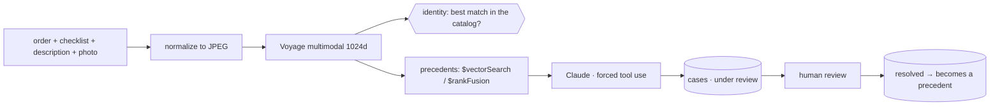

# Triagem multimodal de garantia

Todo varejista que envia produtos físicos recebe milhares de acionamentos de garantia: uma foto, uma descrição vaga ("chegou quebrado") e um analista que precisa decidir — defeito de fábrica, avaria de transporte ou mau uso? A triagem é lenta, inconsistente entre analistas, e tudo o que já foi resolvido continua preso em planilhas. E nada garante que a foto enviada seja sequer do produto comprado.

Esta PoV faz a triagem do acionamento com IA multimodal, tendo o MongoDB Atlas como motor por trás de todas as camadas: Voyage para os embeddings, Claude para o veredito, um humano para a decisão.

## A demo em 4 passos

**1. O cliente abre um chamado.** Número do pedido, checklist de sintomas, descrição, foto. Cenários pré-carregados (incluindo dois em que a foto não corresponde ao produto) deixam isso a um clique.


**2. Isto é sequer o produto certo?** A foto vira embedding e é comparada com as fotos de referência do catálogo *inteiro*. O sinal é relativo — o produto pedido precisa ser o melhor match entre todos eles. Um limiar absoluto sozinho deixaria passar o produto errado, já que fotos de estúdio pontuam alto umas contra as outras de qualquer jeito.

**3. Precedentes, e então um veredito estruturado.** O `$vectorSearch` (ou o híbrido `$rankFusion`) recupera chamados resolvidos parecidos com este, e o Claude classifica a causa provável com *uso forçado de ferramenta* — saída estruturada, sem parsing frágil de JSON em texto livre.


A execução acima é um bom exemplo do modelo não blefando: a foto enviada era uma imagem de catálogo sem dano visível, então o veredito voltou **inconclusivo com 35% de confiança**, dizendo exatamente isso e pedindo uma foto do defeito real.

**4. Um humano decide.** Todo veredito nasce `em_analise`; só uma pessoa o promove a `resolvido` — exigência do direito do consumidor no Brasil. Cada chamado confirmado vira precedente para os próximos. A fila se atualiza por um Change Stream, sem polling.



```mermaid
flowchart LR
    A[order + checklist + description + photo] --> B[normalize to JPEG]
    B --> C[Voyage multimodal 1024d]
    C --> D{{"identity: best match in the catalog?"}}
    C --> E["precedents: $vectorSearch / $rankFusion"]
    E --> F[Claude · forced tool use]
    F --> G[(cases · under review)]
    G --> H[human review] --> I[(resolved → becomes a precedent)]
```

> Os screenshots rodam contra um cluster real com um catálogo de demonstração; o nome do varejista foi trocado por um nome neutro.

## MongoDB por trás de cada camada

| Camada | Onde vive |
|---|---|
| Busca do pedido | `pedidos` |
| Checklist de defeitos | `catalogo` |
| Chamados + veredito + embedding | `chamados` |
| Fotos de referência do catálogo | `catalogo_fotos` |
| Busca semântica | Vector Search (`defeitos_vector_index`) |
| Busca híbrida | `$rankFusion` + Atlas Search (`chamados_text_index`) |
| Fila de revisão ao vivo | Change Streams por SSE |
| Analytics | Aggregation Pipeline (pronto para Atlas Charts) |
| Governança de schema | validadores `$jsonSchema` |

Os blobs de imagem ficam **fora** do MongoDB — o padrão correto para blobs. Na PoV eles ficam no disco local (`backend/media/`); em produção você reimplementa o `storage.py` com S3 + CDN e a interface `(uri, url)` não muda.

**Stack:** FastAPI + Motor · Voyage `voyage-multimodal-3.5` (1024d) · Claude com uso forçado de ferramenta · React + Vite + LeafyGreen. Tudo (banco, coleções, índices, modelos) é parametrizado no `.env` — veja o `.env.example`, e nunca commite um `.env` real.

## Setup

O repositório não traz fotos de seed de propósito — use as suas, para que a demo reflita um catálogo real em vez de imagens genéricas de "produto danificado".

```bash
cd backend
python3 -m venv .venv && ./.venv/bin/pip install -r requirements.txt
export SEED_IMAGES_DIR=/caminho/para/suas/fotos     # ou defina no .env

# layout esperado: cad_01.jpg … e catalogo/<sku>/1.jpg … N.jpg
./.venv/bin/python seed_meta.py             # pedidos + checklist
./.venv/bin/python seed.py                  # 15 chamados resolvidos (gera embeddings das imagens)
./.venv/bin/python seed_catalogo_fotos.py   # fotos de referência por SKU
./.venv/bin/python setup_indexes.py         # índices + $jsonSchema

# ainda sem fotos? placeholders sintéticos:
./.venv/bin/python generate_placeholders.py
./.venv/bin/python generate_catalogo_placeholders.py
```

## Execução

```bash
./start.sh                                  # backend :8100 + frontend :5190
cd backend && ./.venv/bin/python test_http.py   # smoke test do pipeline completo
```

Por padrão, o launcher serve o build otimizado do frontend sem watcher. Para editar com HMR, rode `POV_DEV=1 ./start.sh`; o build só é refeito quando as fontes ou a configuração mudam.

```bash
cd backend
./.venv/bin/pip install -r requirements-dev.txt
./.venv/bin/pytest        # testes unitários, sem Atlas nem rede
./.venv/bin/ruff check .
```

Docker: `docker build -t mm-garantia . && docker run --env-file .env -p 18081:8080 mm-garantia`.

## Endpoints

| Método | Rota | O quê |
|---|---|---|
| POST | `/api/lookup` | pedido → produtos |
| GET | `/api/checklist/{categoria}` | itens do checklist |
| POST | `/api/analisar` | pipeline completo; `modo=vector` ou `hybrid` |
| GET | `/api/chamados/pendentes` | fila de revisão |
| POST | `/api/revisar` | revisão humana → resolvido |
| GET | `/api/analytics` | agregações |
| GET | `/api/chamados/stream` | Change Stream (SSE) |
| GET | `/api/health` · `/api/metrics` | ping + contagens · latência, tokens |

## Fronteira de produção

Os uploads são limitados por bytes, quantidade de pixels, número de imagens e tamanho da descrição; IDs de checklist e caminhos de armazenamento passam por allowlist. A imagem roda como UID 10001 atrás de uma configuração nginx com cabeçalhos de segurança. A autenticação está intencionalmente fora desta PoV: exponha-a apenas atrás de um IdP/API gateway com TLS, cotas de requisição e armazenamento de objetos no lugar do diretório de mídia local.
