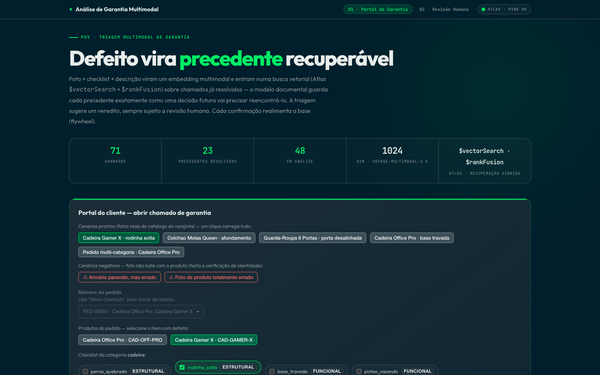
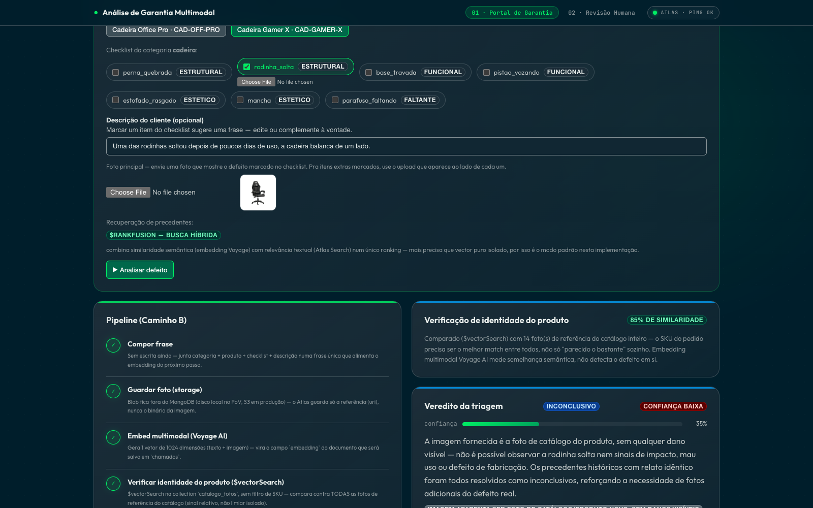
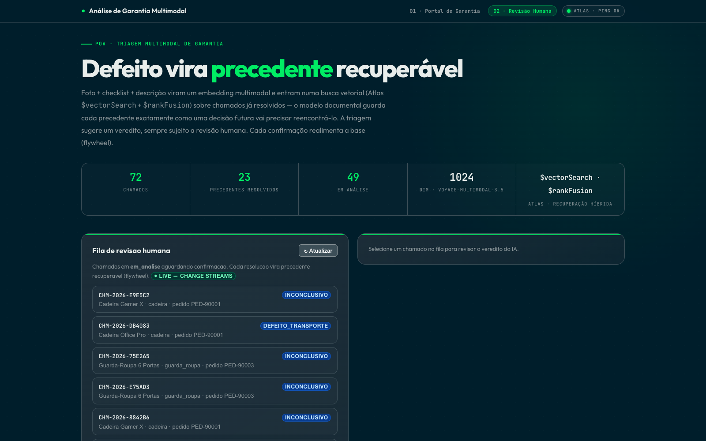
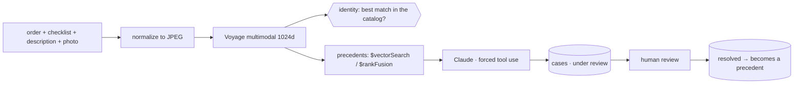

# Multimodal Warranty Triage

Any retailer shipping physical products gets thousands of warranty claims: a photo, a vague description ("it arrived broken"), and an analyst who has to decide — factory defect, shipping damage, or misuse? Triage is slow, inconsistent between analysts, and everything already resolved stays locked in spreadsheets. And nothing guarantees the uploaded photo is even of the purchased product.

This PoV triages the claim with multimodal AI, with MongoDB Atlas as the engine behind every layer: Voyage for the embeddings, Claude for the verdict, a human for the decision.

## The demo in 4 steps

**1. The customer opens a claim.** Order number, symptom checklist, description, photo. Pre-loaded scenarios (including two where the photo doesn't match the product) make it one click.



**2. Is this even the right product?** The photo is embedded and compared against reference photos of the *entire* catalog. The signal is relative — the ordered product must be the best match among all of them. An absolute threshold alone would let the wrong product through, since studio photos score high against each other anyway.

**3. Precedents, then a structured verdict.** `$vectorSearch` (or hybrid `$rankFusion`) retrieves resolved cases similar to this one, and Claude classifies the probable cause with *forced tool use* — structured output, no fragile JSON parsing off free text.



The run above is a good example of the model not bluffing: the uploaded photo was a catalog shot with no visible damage, so the verdict came back **inconclusive at 35% confidence**, saying exactly that and asking for a photo of the actual defect.

**4. A human decides.** Every verdict is born `em_analise`; only a person promotes it to `resolvido` — a consumer-protection requirement in Brazil. Each confirmed case becomes a precedent for the next ones. The queue updates through a Change Stream, no polling.




```mermaid
flowchart LR
    A[order + checklist + description + photo] --> B[normalize to JPEG]
    B --> C[Voyage multimodal 1024d]
    C --> D{{"identity: best match in the catalog?"}}
    C --> E["precedents: $vectorSearch / $rankFusion"]
    E --> F[Claude · forced tool use]
    F --> G[(cases · under review)]
    G --> H[human review] --> I[(resolved → becomes a precedent)]
```

> Screenshots run against a live cluster with a demo catalog; the retailer's name is replaced with a neutral one.

## MongoDB behind every layer

| Layer | Where it lives |
|---|---|
| Order lookup | `pedidos` |
| Defect checklist | `catalogo` |
| Cases + verdict + embedding | `chamados` |
| Catalog reference photos | `catalogo_fotos` |
| Semantic search | Vector Search (`defeitos_vector_index`) |
| Hybrid search | `$rankFusion` + Atlas Search (`chamados_text_index`) |
| Live review queue | Change Streams over SSE |
| Analytics | Aggregation Pipeline (Atlas Charts-ready) |
| Schema governance | `$jsonSchema` validators |

Image blobs stay **outside** MongoDB — the correct blob pattern. In the PoV they sit on local disk (`backend/media/`); in production you reimplement `storage.py` with S3 + CDN and the `(uri, url)` interface doesn't change.

**Stack:** FastAPI + Motor · Voyage `voyage-multimodal-3.5` (1024d) · Claude with forced tool use · React + Vite + LeafyGreen. Everything (DB, collections, indexes, models) is parameterized in `.env` — see `.env.example`, and never commit a real one.

## Setup

The repo ships no seed photos on purpose — bring your own so the demo reflects a real catalog instead of stock "damaged product" images.

```bash
cd backend
python3 -m venv .venv && ./.venv/bin/pip install -r requirements.txt
export SEED_IMAGES_DIR=/path/to/your/photos     # or set it in .env

# expected layout: cad_01.jpg … and catalogo/<sku>/1.jpg … N.jpg
./.venv/bin/python seed_meta.py             # orders + checklist
./.venv/bin/python seed.py                  # 15 resolved cases (embeds their images)
./.venv/bin/python seed_catalogo_fotos.py   # reference photos per SKU
./.venv/bin/python setup_indexes.py         # indexes + $jsonSchema

# no photos yet? synthetic placeholders:
./.venv/bin/python generate_placeholders.py
./.venv/bin/python generate_catalogo_placeholders.py
```

## Run

```bash
./start.sh                                  # backend :8100 + frontend :5190
cd backend && ./.venv/bin/python test_http.py   # full-pipeline smoke test
```

```bash
cd backend
./.venv/bin/pip install -r requirements-dev.txt
./.venv/bin/pytest        # unit tests, no Atlas or network
./.venv/bin/ruff check .
```

Docker: `docker build -t mm-garantia . && docker run --env-file .env -p 18081:8080 mm-garantia`.

## Endpoints

| Method | Route | What |
|---|---|---|
| POST | `/api/lookup` | order → products |
| GET | `/api/checklist/{categoria}` | checklist items |
| POST | `/api/analisar` | full pipeline; `modo=vector` or `hybrid` |
| GET | `/api/chamados/pendentes` | review queue |
| POST | `/api/revisar` | human review → resolved |
| GET | `/api/analytics` | aggregations |
| GET | `/api/chamados/stream` | Change Stream (SSE) |
| GET | `/api/health` · `/api/metrics` | ping + counts · latency, tokens |
