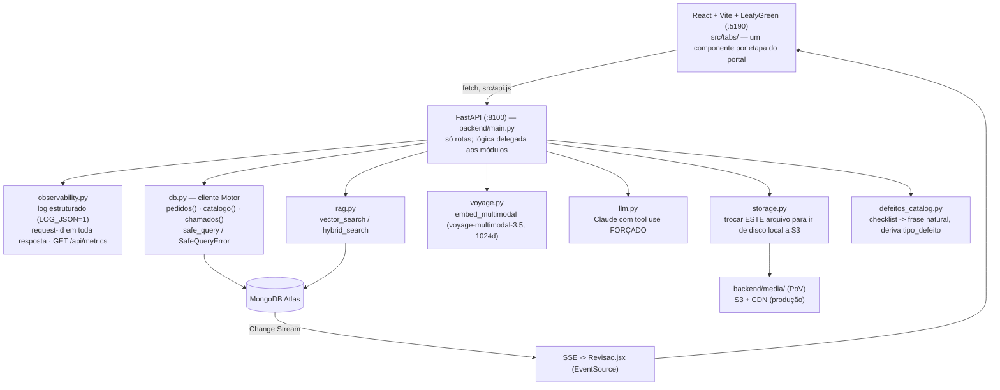
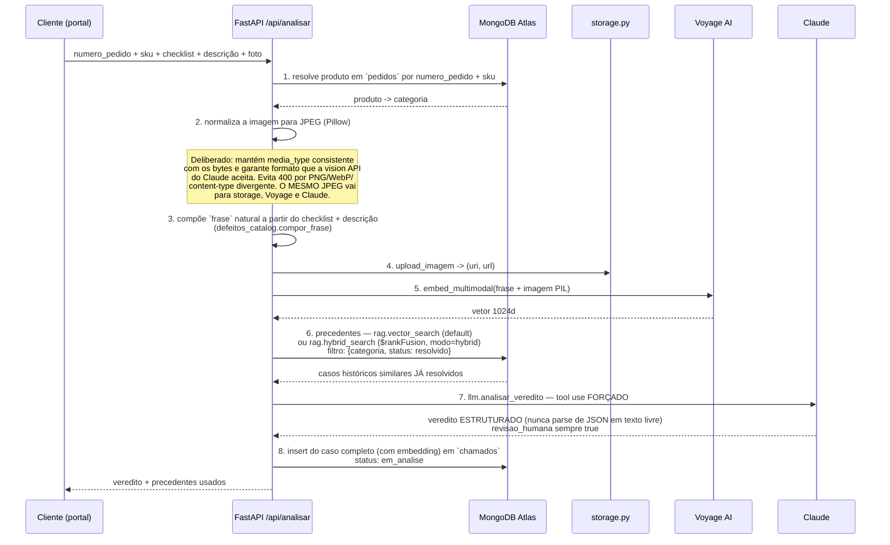

# Análise de Garantia com IA — Triagem de Defeito para Varejo Físico

PoV genérico de triagem de defeito em garantia, usável por qualquer varejista que venda produto físico.

O fluxo do cliente é curto: **procura o pedido, marca um checklist de defeito, descreve o problema, envia uma foto.** Antes de classificar, a foto ainda é comparada contra as fotos de referência do SKU no catálogo — um sinal separado de *"isso é sequer o produto certo?"*. O Claude então classifica a causa provável usando precedentes históricos recuperados por busca vetorial.

Verdicto possível: **defeito de fábrica / transporte / mau uso / inconclusivo**. E sempre marcado para revisão humana — o CDC exige isso no Brasil, então `revisao_humana` é `true` por construção, não por configuração.

---

## 1. MongoDB é o motor de todas as camadas, não só o storage

Esta tabela é o argumento comercial inteiro do PoV em oito linhas:

| Camada | Onde vive |
|---|---|
| Consulta de pedido | coleção `pedidos` |
| Catálogo de checklist de defeito | coleção `catalogo` |
| Casos + veredito + embedding | coleção `chamados` |
| Busca semântica | Atlas Vector Search (`$vectorSearch`, índice `defeitos_vector_index`) |
| Busca híbrida | `$rankFusion` (vetor + Atlas Search full-text, índice `chamados_text_index`) |
| Fila de revisão ao vivo | Change Streams via SSE — ligado no `Revisao.jsx` por `EventSource`, **sem polling** |
| Analytics | Aggregation Pipeline (alimenta Atlas Charts) |
| Governança de schema | validador `$jsonSchema` em `chamados`/`pedidos` (`validationAction=warn`, aplicado por `setup_indexes.py`) |

Um cluster. Nenhum vector DB separado, nenhum motor de busca separado, nenhuma fila separada.

**Imagem e blob nunca vão para o MongoDB.** No PoV vão para disco local (`backend/media/`, servido por static files do FastAPI). Em produção troca-se `storage.py` por S3 + CDN **atrás do mesmo contrato de retorno `(uri, url)`**. Não mudar essa interface.

---

## 2. Arquitetura



**Tudo é parametrizado por `.env`** — nome de database, de coleção, de índice, de modelo. Lido uma vez por `backend/config.py`, que sobe a árvore de diretórios procurando o `.env`, então funciona com o arquivo na raiz do repositório ou dentro de `mm-analise-garantia/`.

**Nunca hardcodar nome de coleção, índice ou modelo.** Adicionar em `config.py` + `.env.example`.

---

## 3. O fluxo de análise — `POST /api/analisar`



### Por que o veredito usa tool use forçado

Porque parse de JSON em cima de texto livre de LLM quebra em produção, sempre. Com tool use forçado a saída é estruturada por contrato do modelo — não tem "às vezes ele coloca uma crase a mais".

### O ciclo de aprendizado

`POST /api/revisar` vira o `status` para `resolvido` e seta `veredito.revisao_humana=True`.

**É isso que torna um caso elegível como precedente futuro.** Só caso revisado por humano alimenta a busca de precedente do próximo caso — o filtro `{status: resolvido}` no passo 6 garante isso. O sistema fica melhor conforme os analistas trabalham, e nenhum verdito não-revisado contamina a base.

---

## 4. Comparação com o catálogo — sinal separado

Antes da classificação, a foto enviada é comparada contra as fotos de referência do SKU (`catalogo_fotos`), com embedding multimodal Voyage + `$vectorSearch`.

Esse sinal responde uma pergunta diferente da causa do defeito: **"o cliente está fotografando o produto que ele comprou?"**. Manter separado do veredito é intencional — misturar os dois faria uma foto errada virar "mau uso", que é uma conclusão bem diferente de "produto trocado".

---

## 5. Tratamento de erro — uma via só

Toda chamada ao banco passa por `db.safe_query(...)`, que embrulha exceção em `SafeQueryError(kind, message)`. Um único `@app.exception_handler(SafeQueryError)` em `main.py` converte isso em 503 com corpo JSON `{"error": {"kind", "message"}}`, que o frontend renderiza como Banner.

**Falha de domínio também levanta `SafeQueryError` direto** — pedido não encontrado, SKU inválido, embedding ausente. Não inventar caminho de erro paralelo.

---

## 6. Modelo de dados

| Coleção | Conteúdo |
|---|---|
| `pedidos` | Pedidos e itens, com SKU e categoria. Validador `$jsonSchema` (`validationAction=warn`) |
| `catalogo` | Catálogo de checklist de defeito por categoria |
| `catalogo_fotos` | Fotos de referência por SKU, com embedding multimodal |
| `chamados` | Casos: checklist, descrição, imagem (uri/url), embedding, veredito, status. Validador `$jsonSchema` |

Índices criados por `setup_indexes.py`, todos com nome vindo do `.env`:
- Regulares (operacionais)
- `defeitos_vector_index` — Atlas Vector Search
- `chamados_text_index` — Atlas Search full-text, necessário para o `$rankFusion`

Estados de `chamados`: `em_analise` → (revisão humana) → `resolvido`.

---

## 7. Como rodar

### Setup único
```bash
cd backend
python3 -m venv .venv && ./.venv/bin/pip install -r requirements.txt
./.venv/bin/python seed_meta.py      # popula pedidos + catalogo
./.venv/bin/python seed.py           # 15 chamados resolvidos (embeda as imagens deles)
./.venv/bin/python setup_indexes.py  # índices regulares + vetorial + text search
```

### Rodar — backend :8100 + frontend :5190
```bash
./start.sh          # ou ./run.sh — abre o browser, loga em /tmp/mm-garantia-*.log
```

### Smoke test do pipeline completo
```bash
cd backend && ./.venv/bin/python test_http.py   # lookup -> checklist -> analisar
```

`test_http.py` é smoke test manual contra um backend rodando. **Não faz parte do `pytest`**, sem auto-discovery — rodar explicitamente.

### Testes unitários e lint
```bash
cd backend
./.venv/bin/pip install -r requirements-dev.txt
./.venv/bin/pytest                   # backend/tests/
./.venv/bin/ruff check .
```

### Frontend isolado
```bash
cd frontend && npm install --legacy-peer-deps && npm run dev
```

O `--legacy-peer-deps` é obrigatório: o LeafyGreen tem conflito de peer-dep com a versão atual do React. `start.sh` e `run.sh` já fazem isso.

### Portas

8100 e 5190 foram escolhidas de propósito para não colidir com outro PoV que roda em 8000/5173-5174 na mesma máquina. `start.sh`/`run.sh` **pulam** o start do backend se a 8100 já estiver ocupada — matar uvicorn órfão se precisar de restart limpo.

---

## 8. Frontend

A demo tem duas pontas: o cliente que abre o chamado e o analista que revisa. As duas precisam estar na tela ao mesmo tempo, em janelas diferentes — é assim que o Change Stream deixa de ser um bullet de slide e vira uma coisa que acontece na frente de quem assiste.

Regra que vale pra tudo: **a UI não conclui nada.** Veredito, tipo de defeito, comparação com o catálogo e precedentes vêm todos do backend. O React exibe e organiza.

### 8.1 Stack

React 18 + Vite + LeafyGreen, JavaScript sem TypeScript, `fetch` cru embrulhado em `api.js`. Sem router, sem biblioteca de estado.

`@leafygreen-ui/code` importa aqui pelo mesmo motivo do PoV de intelligence layer: mostrar o documento MongoDB cru na tela. Quando o cliente pergunta "mas o que exatamente ficou salvo?", a resposta é abrir o JSON.

`nodePolyfills` é obrigatório — `@emotion/server`, dependência transitiva do LeafyGreen, usa builtins do Node.

Portas fixas com `strictPort: true` (Vite em 5190), e o proxy encaminha **duas** rotas pro backend em 8100: `/api` e `/media`. A segunda serve as imagens dos chamados, que em produção sairiam do S3 + CDN (ver `storage.py`).

### 8.2 Estado no shell

`App.jsx` guarda `portalState` e `revisaoState` e passa por props. As abas não são donas do próprio estado, pelo mesmo motivo prático de sempre: na demo eu alterno entre Portal e Revisão o tempo todo, e o resultado da análise precisa continuar lá quando eu volto.

O Portal também recebe `goRevisar`, que troca de aba programaticamente. Depois de analisar um caso, o caminho natural é ir ver ele entrando na fila — sem obrigar ninguém a caçar a aba certa no meio da apresentação.

### 8.3 As duas abas

| Aba | Componente | O que precisa ficar visível |
|---|---|---|
| **Portal** | `Portal.jsx` (520 linhas) | O fluxo do cliente: pedido, checklist, foto, veredito **com os precedentes que o justificaram** |
| **Revisão** | `Revisao.jsx` | A fila do analista, alimentada ao vivo por Change Stream |

O Portal é grande porque é um fluxo de várias etapas, e cada etapa carrega um argumento diferente: o pedido vem do catálogo real, o checklist é derivado da categoria (nada hardcoded), a foto passa por embedding multimodal, e a resposta é estruturada por tool use forçado.

### 8.4 Componentes

- **`VeredictoCard`** — o resultado estruturado. É o que o cliente do cliente veria.
- **`PipelineSteps`** — as etapas do `POST /api/analisar` em ordem. Sem isso, a análise parece uma caixa preta que demora e cospe um texto.
- **`IdentidadeCard`** — o sinal de comparação com o catálogo, separado do veredito de defeito de propósito (seção 4). Foto de produto diferente acusa aqui, **antes** de qualquer conclusão sobre causa.
- **`JsonViewer`** — o documento cru quando alguém quiser ver.

A separação entre `IdentidadeCard` e `VeredictoCard` na tela é a tradução visual de uma decisão de backend. São dois sinais independentes, e misturá-los na interface desfaria justamente o cuidado que a seção 4 descreve.

### 8.5 Contrato com o backend

| Função em `api.js` | Endpoint | Aba |
|---|---|---|
| `health()` | `GET /api/health` | Shell |
| `pedidos()` | `GET /api/pedidos` | Portal — lista de pedidos da demo |
| `lookup()` | `POST /api/lookup` | Portal — busca por número de pedido |
| `checklist()` | `GET /api/checklist/{categoria}` | Portal — checklist derivado da categoria |
| `analisar()` | `POST /api/analisar` (multipart) | Portal — o turno de análise |
| `pendentes()` | `GET /api/chamados/pendentes` | Revisão — fila inicial |
| `revisar()` | `POST /api/revisar` | Revisão — fecha o caso |
| — | `GET /api/chamados/stream` (SSE) | Revisão — fila ao vivo |
| — | `GET /api/analytics` | Disponível no backend, ainda sem tela |

`upload()` é separado de `request()` por um motivo específico: **não definir `Content-Type` manualmente no multipart**. O browser precisa gerar o boundary sozinho; setar o header na mão quebra o upload de forma silenciosa e chata de diagnosticar.

### 8.6 Erro tratado como parte da demo

`ApiError` carrega `kind` além da mensagem, e o backend devolve `{error: {kind, message}}` estruturado. A falha de rede tem texto próprio: *"Backend não respondeu. O FastAPI está rodando na porta 8100?"*.

Isso não é capricho. A análise depende de Voyage, Anthropic e Atlas ao mesmo tempo — e mensagem genérica de erro numa demo com cliente custa cinco minutos de improviso. Erro específico deixa óbvio onde olhar, e a seção 5 já garante que o backend tem uma via única de tratamento.

### 8.7 A fila ao vivo

`Revisao.jsx` abre um `EventSource` em `/api/chamados/stream`. Do outro lado tem um Change Stream do Atlas — sem polling, sem fila de mensagem, sem componente extra.

É o beat mais forte do roteiro: duas janelas abertas, analiso um caso no Portal, e ele aparece na Revisão sem ninguém recarregar nada. A fila inicial vem de `pendentes()`; o stream cuida do que chega depois.

### 8.8 Build

```bash
cd frontend && npm install && npm run dev   # :5190, proxia /api e /media -> :8100
cd frontend && npm run build
```

Em produção o nginx (`docker/`, `nginx.conf`) serve o build e faz o mesmo encaminhamento de `/api` e `/media` — mesma origem, sem CORS.

---

## 9. Roteiro de demonstração

1. **Consultar um pedido real** pelo número. Mostrar que produto, categoria e checklist saem do próprio catálogo — nada hardcoded.
2. **Enviar uma foto do produto certo** com um defeito. Mostrar o veredito estruturado e, principalmente, **os precedentes que o justificaram** — a resposta não é opinião do modelo, é modelo raciocinando sobre casos que a operação já resolveu.
3. **Enviar uma foto de produto diferente.** O sinal de comparação com o catálogo acusa antes de qualquer conclusão sobre causa.
4. **Alternar `modo=hybrid`.** Mostrar `$rankFusion` combinando vetorial e full-text numa agregação só.
5. **Abrir a aba de Revisão em outra janela.** Analisar um caso novo e ver ele **aparecer na fila ao vivo, via Change Stream**, sem polling.
6. **Revisar o caso.** Ele vira `resolvido` e, a partir daí, passa a ser candidato a precedente do próximo caso.
7. **Mostrar o validador de schema** rejeitando (em `warn`) um documento fora do contrato.

---

## 10. Stack

| Camada | Tecnologia |
|---|---|
| Backend | FastAPI + Motor (async PyMongo) |
| Embedding | Voyage AI `voyage-multimodal-3.5`, 1024 dimensões, multimodal (texto + imagem) |
| LLM | Anthropic Claude, com tool use forçado |
| Imagem | Pillow, normalização para JPEG |
| Busca | Atlas Vector Search + Atlas Search + `$rankFusion` |
| Tempo real | Change Streams -> SSE -> `EventSource` |
| Frontend | React + Vite + LeafyGreen |
| Observabilidade | `observability.py` — log estruturado, request-id, `/api/metrics` |
| Deploy | Docker (`Dockerfile`, `docker/`, `nginx.conf`), devcontainer |

Nota de repositório: o git repo e a aplicação ficam **um diretório abaixo** de `MadeiraMadeira/` — em `MadeiraMadeira/mm-analise-garantia/`.

---

## 11. Fronteiras do PoV

- Blobs em disco local, não em S3 — a troca é um arquivo (`storage.py`), atrás do mesmo contrato.
- Sem autenticação. O portal assume um cliente já identificado pelo e-commerce.
- `validationAction=warn`, não `error` — para o PoV não travar em documento legado.
- Os 15 chamados de seed são sintéticos; a qualidade do precedente em produção depende do volume real de casos revisados.

---

## 12. Caminho para produção

| Item | No PoV | Em produção |
|---|---|---|
| Blobs | Disco local via `storage.py` | S3 + CDN, mesma interface `(uri, url)` |
| Autenticação | Ausente | SSO do e-commerce; `numero_pedido` validado contra a sessão, nunca aceito solto |
| Schema | `validationAction=warn` | `error`, após saneamento do legado |
| Revisão humana | Sempre obrigatória (CDC) | Continua obrigatória — mas com priorização por confiança do veredito e SLA |
| Precedentes | 15 casos de seed | Base viva; considerar recorte por janela temporal para não deixar defeito descontinuado enviesar |
| Custo | Chamada Voyage + Claude por análise | Cache por SKU + checklist idêntico; recomparação só quando a foto muda |
